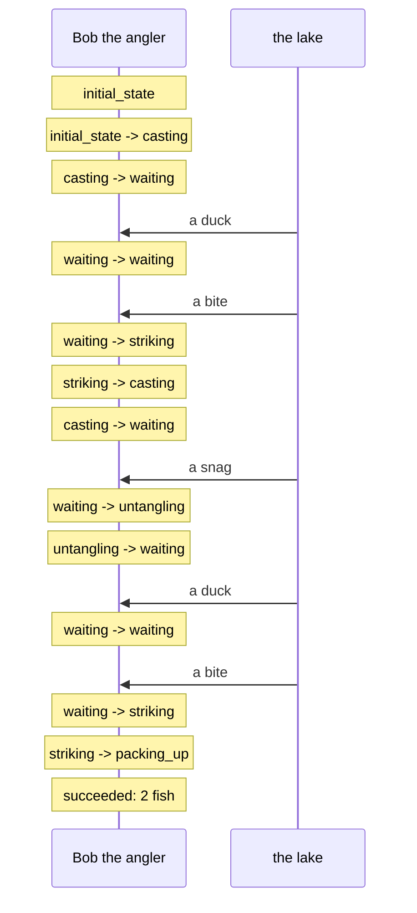

# Samples

Runnable examples. Each one is a single file you can execute, read top to bottom,
and change.

```
mix run samples/fishing.exs
```

| Sample | What it is | What it shows |
|---|---|---|
| [`fishing.exs`](fishing.exs) | a fishing trip, played out in ~2 seconds | the deadline that does not restart, `stay`, `goto back`, a sub-FSM, a host, the Mermaid diagram |

---

## `fishing.exs` — a fishing trip

Bob casts a line. Ducks paddle past, the line snags, and twice something bites —
and each time he has 400 ms to strike before it spits the hook. His hands take
250 ms to move. He goes home with two fish, and the trip prints itself as a
diagram.

```
🎣  A fishing trip, as a finite state machine

  Bob the angler arrives. Quota: 2 fish.
  A cast. The float settles.
  (Gerald the duck paddles past. You wait.)
  Something tugs the line — a perch!
  Hooked! That is 1 of 2.
  A cast. The float settles.
  The line catches on a shopping trolley.
  You free the line. Nothing was harmed except your afternoon.
  (Gerald, again the duck paddles past. You wait.)
  Something tugs the line — a pike!
  Hooked! That is 2 of 2.
  Bob the angler goes home with: perch, pike.

  → :ok
```

followed by the same afternoon as a Mermaid diagram, which renders as-is in a
GitHub comment:



### Why a fishing trip

Because it needs exactly what the language is for, and needs it for reasons a
reader already believes rather than reasons they have to be taught.

**A deadline that does not restart.** `waiting` gives Bob ten seconds of
patience. A duck paddling past is worth noticing and worth nothing else, so the
clause answers with `stay` — the state does not run again, the float is not
recast, **and the ten seconds are not re-armed**. Ducks eat your afternoon. That
is the whole difference between `stay` and `goto loop`, and it is a bug wearing a
feature's clothes if you get it the other way round: a keep-alive answered every
ten seconds would hold a thirty-second answer timeout open forever.

**A detour that returns by itself.** A snag sends the trip to `untangling`, which
ends on `goto back`. That state does not know where it came from, and does not
need to: `back` is one slot, written only when the state actually changes. Move
the snag clause into `casting` and the detour returns there instead, with no edit
to `untangling`.

**Hands as a second process.** Reaction time is 250 ms of *doing nothing*, and a
machine must never block — a `Process.sleep` in a state would freeze every event
behind it. So the hands are a sub-FSM: `spawn_fsm` gives them a process and a
mailbox of their own, the trip pokes them with `notify/2`, they answer with
`notify_parent/1`, and the trip waits for `{:child_msg, :hands, :strike}` with an
`after` that decides whether the fish got away.

**A host, in eight lines.** Everything the language refuses to decide for itself
is a callback, and a host inherits the default for every one it leaves out. This
one answers two questions: draw with Mermaid, and *a lake event is a lake event*.

That second one is the interesting half. FSL classifies its own vocabulary — a
message from a child, a control message — and asks the embedding about everything
else, **including the fallback for something it has never seen**. Delete
`event_type/1` from the host and run it again: the trip is identical and the
diagram is a column of notes with no arrows in it. That is exactly how much the
language depends on knowing a protocol, and exactly where the knowing lives.

### Things to try

- `reaction_ms: 600` in the `config` block — Bob is too slow, every fish escapes,
  and he goes home skunked. The machine reports `{:error, "skunked"}`;
- `quota: 3` — the lake only has two fish in its script, so the trip runs out of
  patience and ends on the `after` of `waiting`;
- delete `event_type/1` from `Fishing.Host` — see above;
- swap `FSL.Diagram.Mermaid` for `FSL.Diagram.PlantUML` in the host and the file
  becomes a `.puml` with a coloured media lane it does not use;
- add `{:duck, "Gerald, a third time"}` to the lake's script and watch the
  patience run out anyway, because `stay` did not re-arm it.

### Two things the file is careful about, and says so

**The host is declared before the machine that names it.** Three of the twelve
callbacks are asked *while the machine compiles* — which type a clause's event
carries, which clauses to inject into every wait, whether the machine already
handles them. A host defined further down the file does not exist yet when those
questions are asked, and the machine silently gets the defaults. This is the one
ordering rule a single-file example has to respect.

**The lake is not a state machine.** It is a process with a script, feeding
events. In a real embedding that is where a protocol would be — a socket, a SIP
dialog, a WebSocket — and FSL never knows the difference. An event is an event.
